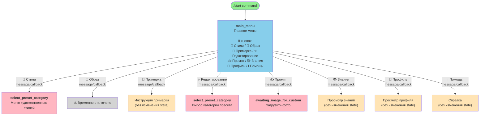
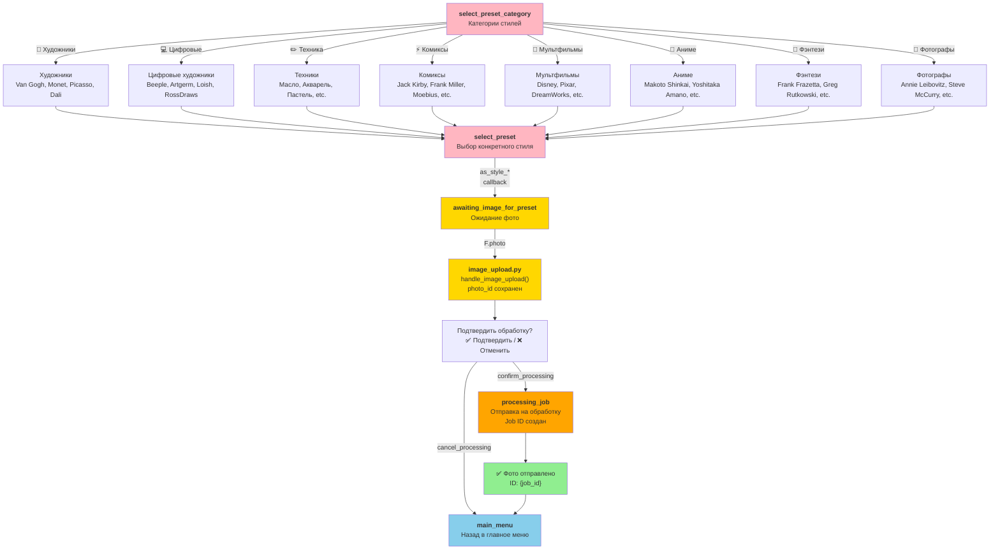
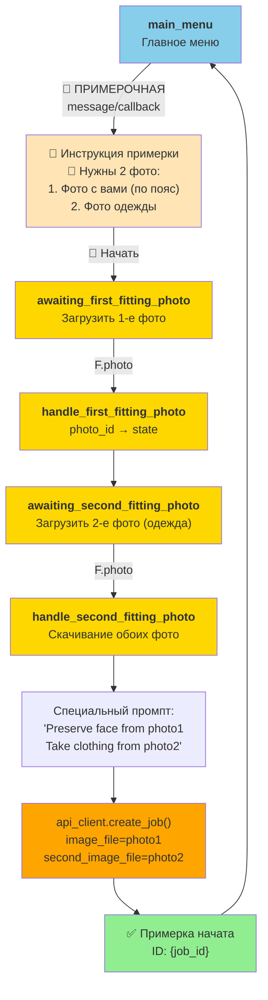
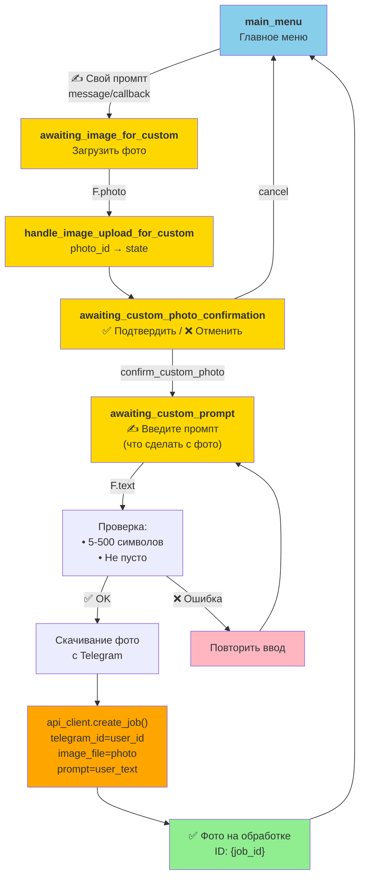
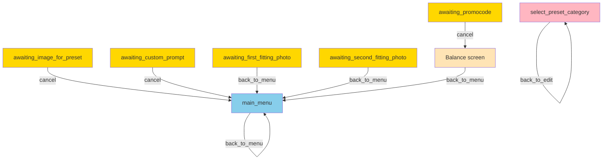

# FSM Диаграмма навигации QwenEditBot

Полная диаграмма потоков состояния бота с переходами между экранами и обработчиками.

## 1. Главное меню и основные переходы



## 2. Поток "Художественные стили"



## 3. Поток "Примерочная" (2 фото)



## 4. Поток "Свой промпт"



## 5. Поток "Профиль и платежи"

```mermaid
graph TD
    MainMenu["<b>main_menu</b><br/>Главное меню"]
    
    MainMenu -->|👩 Профиль<br/>message/callback| Profile["Профиль<br/>💰 Баланс: N баллов<br/>📊 Статистика"]
    
    Profile -->|💰 Пополнить| TopUp["<b>awaiting_payment</b><br/>Выбор суммы:<br/>300/500/1000/2000/3000/5000 ₽"]
    Profile -->|🎁 Промокод| PromoCode["<b>awaiting_promocode</b><br/>Введите промокод"]
    Profile -->|📜 История| History["История платежей<br/>(показать список)"]
    Profile -->|🏠 Меню| MainMenu
    
    TopUp -->|pay_{amount}_{bonus}| Confirm["💳 Подтвердить<br/>Сумма: {amount}₽<br/>Получите: {points} баллов"]
    
    Confirm -->|confirm_pay_*| Payment["api_client.create_payment()<br/>ЮКасса payment link"]
    
    Payment --> Notification["✅/❌ Уведомление<br/>о статусе платежа"]
    
    Notification --> MainMenu
    
    PromoCode -->|F.text| ValidateCode["Проверка промокода<br/>api_client.use_promocode()"]
    
    ValidateCode -->|✅ Valid| Success["✅ Баллы добавлены<br/>Новый баланс: {balance}"]
    ValidateCode -->|❌ Invalid| Error["❌ Неверный промокод"]
    
    Success --> Profile
    Error --> PromoCode
    History --> MainMenu
    
    style MainMenu fill:#87CEEB
    style Profile fill:#FFE4B5
    style TopUp fill:#FFD700
    style PromoCode fill:#FFD700
    style History fill:#FFE4B5
    style Confirm fill:#FFD700
    style Payment fill:#FFA500
    style Notification fill:#90EE90
    style Success fill:#90EE90
    style Error fill:#FFB6C1
```

## 6. Поток "Редактирование фото"

```mermaid
graph TD
    MainMenu["<b>main_menu</b><br/>Главное меню"]
    
    MainMenu -->|✨ Редактировать<br/>message/callback| EditMenu["<b>select_preset_category</b><br/>Выбор способа:<br/>🧩 Пресет или ✍️ Свой"]
    
    EditMenu -->|edit_preset| Category["Выбор категории<br/>Стили/Портреты/Товары/etc."]
    EditMenu -->|edit_custom| CustomFlow["Переход в поток<br/>'Свой промпт'"]
    
    Category -->|category_*| PresetList["Список пресетов<br/>в выбранной категории"]
    
    PresetList -->|preset_{id}| SelectPreset["<b>awaiting_image_for_preset</b><br/>Выбран пресет<br/>Загрузить фото"]
    
    SelectPreset -->|F.photo| Upload["Загрузка фото<br/>(как в потоке Стили)"]
    
    CustomFlow --> CustomStart["<b>awaiting_image_for_custom</b><br/>(как в потоке Промпт)"]
    
    Upload --> MainMenu
    CustomStart --> MainMenu
    
    style MainMenu fill:#87CEEB
    style EditMenu fill:#FFB6C1
    style Category fill:#FFB6C1
    style PresetList fill:#FFB6C1
    style SelectPreset fill:#FFD700
    style CustomFlow fill:#FFB6C1
    style CustomStart fill:#FFD700
```

## 7. Матрица коллбэков

| Коллбэк | Файл | Функция | Переход | FSM State |
|---------|------|---------|---------|-----------|
| `back_to_menu` | menu.py | callback_back_to_menu | главное меню | main_menu |
| `back_to_balance` | menu.py | callback_back_to_balance | показать баланс | - |
| `back_to_edit` | presets.py | callback_back_to_edit | категории | select_preset_category |
| `as_root` | menu.py | callback_artistic_styles_root | меню стилей | - |
| `as_artists` | menu.py | callback_artistic_styles_artists | художники | - |
| `as_artists_digital` | menu.py | callback_artistic_styles_digital_artists | цифровые | - |
| `as_technique` | menu.py | callback_artistic_styles_technique | техники | - |
| `as_comics` | menu.py | callback_artistic_styles_comics | комиксы | - |
| `as_cartoons` | menu.py | callback_artistic_styles_cartoons | мультфильмы | - |
| `as_anime` | menu.py | callback_artistic_styles_anime | аниме | - |
| `as_fantasy` | menu.py | callback_artistic_styles_fantasy | фэнтези | - |
| `as_photographers` | menu.py | callback_artistic_styles_photographers | фотографы | - |
| `as_style_*` | menu.py | callback_artistic_style_selected | загрузить фото | awaiting_image_for_preset |
| `edit_preset` | menu.py | callback_edit_preset | категории | select_preset_category |
| `edit_custom` | menu.py | callback_edit_custom | промпт | awaiting_image_for_custom |
| `category_*` | presets.py | callback_category | пресеты | select_preset |
| `preset_*` | presets.py | callback_preset_selected | загрузить фото | awaiting_image_for_preset |
| `cancel` | custom_prompt.py / presets.py / image_upload.py | callback_cancel_* | главное меню | main_menu |
| `confirm_custom_photo` | custom_prompt.py | callback_confirm_custom_photo | ввод промпта | awaiting_custom_prompt |
| `top_up` | balance.py | callback_top_up | выбор суммы | awaiting_payment |
| `pay_*` | payments.py | handle_payment_amount | подтверждение | awaiting_payment |
| `confirm_pay_*` | payments.py | handle_confirm_payment | платеж | awaiting_payment |
| `check_payment_*` | payments.py | handle_check_payment | проверка статуса | - |
| `enter_promocode` | promocodes.py | callback_enter_promocode | ввод кода | awaiting_promocode |
| `payment_history` | balance.py | callback_payment_history | история | - |
| `start_fitting` | menu.py | callback_start_fitting | 1-е фото | awaiting_first_fitting_photo |
| `custom_prompt` | custom_prompt.py | callback_custom_prompt | загрузить фото | awaiting_image_for_custom |
| `fitting_room` | menu.py | callback_fitting_room | инструкция | - |
| `knowledge_base` | menu.py | callback_knowledge_base | просмотр | - |
| `profile` | menu.py | callback_profile | просмотр профиля | - |
| `help` | help.py | callback_help | справка | - |

## 8. Обработчики сообщений

| Состояние | Обработчик | Функция | Файл | Действие |
|-----------|-----------|---------|------|---------|
| awaiting_image_for_preset | F.photo | handle_image_upload | image_upload.py | Загрузить фото для пресета |
| awaiting_image_for_custom | F.photo | handle_image_upload_for_custom | image_upload.py | Загрузить фото для промпта |
| awaiting_custom_photo_confirmation | F.photo | handle_custom_photo_reupload | image_upload.py | Переотправить фото |
| awaiting_custom_prompt | F.text | handle_custom_prompt | custom_prompt.py | Ввести промпт (5-500 символов) |
| awaiting_first_fitting_photo | F.photo | handle_first_fitting_photo | menu.py | Загрузить 1-е фото |
| awaiting_second_fitting_photo | F.photo | handle_second_fitting_photo | menu.py | Загрузить 2-е фото + создать job |
| awaiting_promocode | F.text | handle_promocode_input | promocodes.py | Ввести промокод |
| main_menu | F.text == "🎨..." | btn_* | menu.py | Нажать кнопку меню |

## 9. Обработчики команд

| Команда | Обработчик | Функция | Файл | Действие |
|---------|-----------|---------|------|---------|
| /start | cmd_start | start.py | Инициализация → main_menu |
| /help | cmd_help | start.py | Справка |
| /menu | cmd_menu | start.py | Главное меню → main_menu |
| /balance | cmd_balance | start.py | Показать баланс |
| /cancel | cmd_cancel | start.py | Отмена → main_menu |

## 10. Критические переходы (back buttons)



---

**Последнее обновление:** 2026-01-24  
**Версия:** 1.0  
**Статус:** ✅ Полная документация
