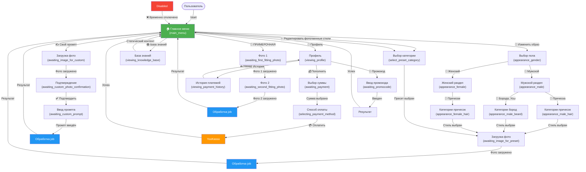

# Навигация Telegram-бота QwenEditBot

Этот документ подробно описывает структуру навигации бота, FSM состояния и всех обработчиков коллбэков.

## 1. FSM состояния

Все состояния определены в [`bot/states.py`](../bot/states.py) в классе `UserState`:

```
UserState
├── main_menu                              # Главное меню
├── select_preset_category                 # Выбор категории пресета
├── select_preset                          # Выбор конкретного пресета
├── awaiting_image_for_preset              # Загрузка фото после выбора пресета
├── awaiting_image_for_custom              # Загрузка фото для кастомного промпта
├── awaiting_custom_photo_confirmation     # Подтверждение загруженного фото
├── awaiting_custom_prompt                 # Ввод кастомного промпта
├── awaiting_first_fitting_photo           # Загрузка первого фото (примерочная)
├── awaiting_second_fitting_photo          # Загрузка второго фото (примерочная)
├── awaiting_payment                       # Выбор суммы пополнения
├── selecting_payment_method               # Выбор способа оплаты (карта/СБП)
├── awaiting_promocode                     # Ввод промокода
├── checking_balance                       # Просмотр баланса
├── viewing_profile                        # Просмотр профиля
├── viewing_payment_history                # Просмотр истории платежей
├── viewing_knowledge_base                 # Просмотр базы знаний
└── processing_job                         # Обработка задания
```

## 2. Главное меню (main_menu)

**Кнопки (Reply keyboard):**

| № | Кнопка | Обработчик | Целевое состояние | Файл |
|----|--------|-----------|------------------|------|
| 1 | 🎨 Художественные стили | `btn_artistic_styles()` | `select_preset_category` | `menu.py` L786 |
| 2 | 🧝 Изменить образ | `btn_change_appearance()` | `appearance_gender` | `menu.py` L802 |
| 3 | 👕 ПРИМЕРОЧНАЯ | `btn_fitting_room()` | `awaiting_first_fitting_photo` | `menu.py` L818 |
| 4 | ✨ Редактировать фото | `btn_edit_photo()` | `select_preset_category` | `menu.py` L986 |
| 5 | ✍️ Свой промпт | `btn_custom_prompt()` | `awaiting_image_for_custom` | `menu.py` L1003 |
| 6 | 📚 База знаний | `btn_knowledge_base()` | `viewing_knowledge_base` | `menu.py` L1042 |
| 7 | 👩 Профиль | `btn_profile()` | `viewing_profile` | `menu.py` L1053 |
| 8 | ℹ️ Помощь | `btn_help()` | (static message) | `menu.py` L1073 |

---

## 3. Основные пути (User Flows)

### Путь 1: Художественные стили → Пресет → Фото → Job

```
main_menu
  ↓
  [🎨 Художественные стили] → btn_artistic_styles()
  ↓
  select_preset_category (showing category_keyboard)
  ↓
  [Категория выбрана] → callback_category_selected()
  ↓
  [Пресет выбран] → callback_preset_selected()
  ↓
  awaiting_image_for_preset
  ↓
  [Фото загружено] → handle_image_upload()
  ↓
  processing_job → create_job()
  ↓
  (Результат отправляется в Telegram уведомлением)
  ↓
  main_menu [через команду /menu или "🏠 Главное меню"]
```

**Файлы:**
- Обработчик кнопки: [`bot/handlers/menu.py`](../bot/handlers/menu.py) L786
- Обработчик пресета: [`bot/handlers/presets.py`](../bot/handlers/presets.py) L87
- Обработчик фото: [`bot/handlers/image_upload.py`](../bot/handlers/image_upload.py)

### Путь 2: Свой промпт → Фото → Промпт → Job

```
main_menu
  ↓
  [✍️ Свой промпт] → btn_custom_prompt() / callback in menu.py
  ↓
  awaiting_image_for_custom (showing cancel_keyboard)
  ↓
  [Фото загружено] → handle_image_upload()
  ↓
  awaiting_custom_photo_confirmation
  ↓
  [✅ Подтвердить] → callback_confirm_custom_photo()
  ↓
  awaiting_custom_prompt
  ↓
  [Промпт введён] → handle_custom_prompt_input()
  ↓
  processing_job → create_job()
  ↓
  main_menu
```

**Файлы:**
- Обработчик: [`bot/handlers/custom_prompt.py`](../bot/handlers/custom_prompt.py)

### Путь 3: ПРИМЕРОЧНАЯ → Фото 1 → Фото 2 → Job

```
main_menu
  ↓
  [👕 ПРИМЕРОЧНАЯ] → btn_fitting_room()
  ↓
  (showing fitting_room_instructions_keyboard)
  ↓
  [🚀 Начать примерку] → callback_start_fitting()
  ↓
  awaiting_first_fitting_photo
  ↓
  [Фото 1 загружено] → handle_first_fitting_photo()
  ↓
  awaiting_second_fitting_photo
  ↓
  [Фото 2 загружено] → handle_second_fitting_photo()
  ↓
  processing_job → create_job()
  ↓
  main_menu
```

**Файлы:**
- Обработчик: [`bot/handlers/menu.py`](../bot/handlers/menu.py) L818

### Путь 4: Профиль → Пополнение → Платёж

```
main_menu
  ↓
  [👩 Профиль] → callback_profile()
  ↓
  viewing_profile (showing profile_menu_keyboard)
  ↓
  [💰 Пополнить баланс] → callback_top_up() in balance.py / payments.py
  ↓
  awaiting_payment
  ↓
  [Выбрана сумма] → handle_payment_amount()
  ↓
  [💳 Оплатить] → handle_confirm_payment()
  ↓
  (Перенаправление на YooKassa / Платёж обрабатывается через webhook)
  ↓
  main_menu
```

**Файлы:**
- Профиль: [`bot/handlers/menu.py`](../bot/handlers/menu.py) L1389
- Платежи: [`bot/handlers/payments.py`](../bot/handlers/payments.py)
- Баланс: [`bot/handlers/balance.py`](../bot/handlers/balance.py)

### Путь 5: Профиль → История платежей

```
main_menu
  ↓
  [👩 Профиль] → callback_profile()
  ↓
  viewing_profile
  ↓
  [📜 История платежей] → callback_payment_history()
  ↓
  viewing_payment_history
  ↓
  [🔙 Назад] → callback_back_to_balance()
  ↓
  viewing_profile
```

**Файлы:**
- Обработчик: [`bot/handlers/balance.py`](../bot/handlers/balance.py) L79

### Путь 6: Профиль → Промокод

```
main_menu
  ↓
  [👩 Профиль] → callback_profile()
  ↓
  viewing_profile (showing profile_menu_keyboard)
  ↓
  [🎁 Промокод] → callback_enter_promocode()
  ↓
  awaiting_promocode
  ↓
  [Промокод введён] → handle_promocode_input()
  ↓
  (успех или ошибка)
  ↓
  viewing_profile
```

**Файлы:**
- Обработчик: [`bot/handlers/promocodes.py`](../bot/handlers/promocodes.py)

### Путь 7: Изменить образ → Пол → Категория → Стиль → Фото → Job

```
main_menu
  ↓
  [🧝 Изменить образ] → btn_change_appearance()
  ↓
  appearance_gender (showing appearance_gender_keyboard)
  ↓
  [👨 Мужской] → callback_appearance_male()
  │  ↓
  │  appearance_male (showing appearance_male_keyboard)
  │  ├─ [💇 Прическа] → callback_appearance_male_hair()
  │  │  ↓
  │  │  appearance_male_hair (showing appearance_male_hairstyle_categories_keyboard)
  │  │  ├─ [✂️ Короткие стрижки] → callback_appearance_male_hair_short()
  │  │  ├─ [🌊 Средняя длина] → callback_appearance_male_hair_medium()
  │  │  └─ [💁 Длинные волосы] → callback_appearance_male_hair_long()
  │  │     ↓
  │  │     [Стиль выбран] → callback_hairstyle_selected()
  │  │     ↓
  │  │     awaiting_image_for_preset
  │  │
  │  └─ [🧔 Борода, Усы] → callback_appearance_male_beard()
  │     ↓
  │     appearance_male_beard (showing appearance_male_beard_keyboard)
  │     ├─ [БЕЗ БОРОДЫ] → callback_appearance_male_beard_none()
  │     ├─ [КОРОТКАЯ БОРОДА] → callback_appearance_male_beard_short()
  │     ├─ [СРЕДНЯЯ БОРОДА] → callback_appearance_male_beard_medium()
  │     ├─ [ДЛИННАЯ БОРОДА] → callback_appearance_male_beard_long()
  │     └─ [УСЫ] → callback_appearance_male_mustache()
  │        ↓
  │        [Стиль выбран] → callback_hairstyle_selected()
  │        ↓
  │        awaiting_image_for_preset
  │
  └─ [👩 Женский] → callback_appearance_female()
     ↓
     appearance_female (showing appearance_female_keyboard)
     └─ [💇 Прически] → callback_appearance_female_hair()
        ↓
        appearance_female_hair (showing appearance_female_hairstyle_categories_keyboard)
        ├─ [✂️ Короткие причёски] → callback_appearance_female_hair_short()
        ├─ [🌊 Средняя длина волос] → callback_appearance_female_hair_medium()
        ├─ [💁 Длинные волосы] → callback_appearance_female_hair_long()
        ├─ [🪮 Чёлки] → callback_appearance_female_hair_bangs()
        ├─ [🎀 Убранные волосы] → callback_appearance_female_hair_updo()
        ├─ [🧵 Косы] → callback_appearance_female_hair_braids()
        └─ [✨ Стилистические направ.] → callback_appearance_female_hair_styles()
           ↓
           [Стиль выбран] → callback_hairstyle_selected()
           ↓
           awaiting_image_for_preset
           ↓
           [Фото загружено] → handle_image_upload()
           ↓
           processing_job → create_job()
           ↓
           main_menu
```

**Файлы:**
- Обработчики: [`bot/handlers/menu.py`](../bot/handlers/menu.py)
- Клавиатуры: [`bot/keyboards.py`](../bot/keyboards.py)

**Статистика стилей:**
- Мужские прически: 21 стиль в каждой категории (короткие, средние, длинные)
- Борода и Усы: 27 стилей (3 без бороды + 5×4 категории + 8 усов)
- Женские прически: 55 стилей (9 коротких + 9 средних + 8 длинных + 6 чёлок + 7 убранных + 7 кос + 9 стилистических)

---

## 4. Коллбэки навигации (Navigation Callbacks)

### Кнопка "🔙 Назад" (back_to_menu)

**Обработчик**: [`bot/handlers/menu.py`](../bot/handlers/menu.py) L1089

**Действие**:
- Очищает состояние
- Устанавливает состояние = `main_menu`
- Показывает главное меню (inline keyboard)

**Используется в**:
- Почти во всех меню (back_and_main_menu_keyboard, edit_photo_submenu_keyboard)

### Кнопка "🏠 Главное меню" (back_to_menu)

Идентично кнопке "Назад" — оба коллбэка используют один обработчик.

### Кнопка "Отмена" (cancel)

**Обработчик**: различные обработчики в зависимости от состояния

**Действие**: возврат в предыдущее меню или главное меню

---

## 5. Таблица всех коллбэков

| Коллбэк | Обработчик | Начальное состояние | Целевое состояние | Файл | Строка |
|---------|-----------|------------------|-----------------|------|---------|
| `back_to_menu` | `callback_back_to_menu()` | любое | `main_menu` | menu.py | 1089 |
| `back_to_balance` | `callback_back_to_balance()` | любое | `viewing_profile` | menu.py | 1108 |
| `edit_preset` | `callback_edit_preset()` | `select_preset_category` | `select_preset_category` | menu.py | 1120 |
| `edit_custom` | `callback_edit_custom()` | `select_preset_category` | `awaiting_image_for_custom` | menu.py | 1136 |
| `top_up` | `callback_top_up()` / `handle_top_up()` | `viewing_profile` | `awaiting_payment` | payments.py | 19 |
| `pay_*` | `handle_payment_amount()` | `awaiting_payment` | `awaiting_payment` | payments.py | 42 |
| `confirm_pay_*` | `handle_confirm_payment()` | `awaiting_payment` | (redirect to YooKassa) | payments.py | 149 |
| `enter_promocode` | `callback_enter_promocode()` | `viewing_profile` | `awaiting_promocode` | promocodes.py | 18 |
| `payment_history` | `callback_payment_history()` | `viewing_profile` | `viewing_payment_history` | balance.py | 79 |
| `balance` | `callback_balance()` | `viewing_payment_history` | `viewing_profile` | balance.py | 49 |
| `profile` | `callback_profile()` | `main_menu` | `viewing_profile` | menu.py | 1389 |
| `knowledge_base` | `callback_knowledge_base()` | `main_menu` | `viewing_knowledge_base` | menu.py | 1361 |
| `category_artistic` | `callback_artistic_styles()` | `main_menu` | `select_preset_category` | menu.py | 1153 |
| `as_root`, `as_artists`, `as_technique`, и т.д. | различные | `select_preset_category` | `select_preset_category` | menu.py | 1171+ |
| `preset_*` | `callback_preset_selected()` | `select_preset_category` | `awaiting_image_for_preset` | presets.py | 87 |
| `back_to_edit` | `callback_back_to_edit()` | `select_preset_category` | `select_preset_category` | presets.py | 142 |
| `change_appearance` | `callback_change_appearance()` | `main_menu` | `appearance_gender` | menu.py | 1341 |
| `appearance_male` | `callback_appearance_male()` | `appearance_gender` | `appearance_male` | menu.py | 1270 |
| `appearance_female` | `callback_appearance_female()` | `appearance_gender` | `appearance_female` | menu.py | 1285 |
| `appearance_male_hair` | `callback_appearance_male_hair()` | `appearance_male` | `appearance_male_hair` | menu.py | 1295 |
| `appearance_male_hair_short` | `callback_appearance_male_hair_short()` | `appearance_male_hair` | `appearance_male_hair_short` | menu.py | 1305 |
| `appearance_male_hair_medium` | `callback_appearance_male_hair_medium()` | `appearance_male_hair` | `appearance_male_hair_medium` | menu.py | 1315 |
| `appearance_male_hair_long` | `callback_appearance_male_hair_long()` | `appearance_male_hair` | `appearance_male_hair_long` | menu.py | 1325 |
| `appearance_male_beard` | `callback_appearance_male_beard()` | `appearance_male` | `appearance_male_beard` | menu.py | 1335 |
| `appearance_male_beard_none` | `callback_appearance_male_beard_none()` | `appearance_male_beard` | `appearance_male_beard_none` | menu.py | 1350 |
| `appearance_male_beard_short` | `callback_appearance_male_beard_short()` | `appearance_male_beard` | `appearance_male_beard_short` | menu.py | 1360 |
| `appearance_male_beard_medium` | `callback_appearance_male_beard_medium()` | `appearance_male_beard` | `appearance_male_beard_medium` | menu.py | 1370 |
| `appearance_male_beard_long` | `callback_appearance_male_beard_long()` | `appearance_male_beard` | `appearance_male_beard_long` | menu.py | 1380 |
| `appearance_male_mustache` | `callback_appearance_male_mustache()` | `appearance_male_beard` | `appearance_male_mustache` | menu.py | 1390 |
| `appearance_female_hair` | `callback_appearance_female_hair()` | `appearance_female` | `appearance_female_hair` | menu.py | 1400 |
| `appearance_female_hair_short` | `callback_appearance_female_hair_short()` | `appearance_female_hair` | `appearance_female_hair_short` | menu.py | 1410 |
| `appearance_female_hair_medium` | `callback_appearance_female_hair_medium()` | `appearance_female_hair` | `appearance_female_hair_medium` | menu.py | 1420 |
| `appearance_female_hair_long` | `callback_appearance_female_hair_long()` | `appearance_female_hair` | `appearance_female_hair_long` | menu.py | 1430 |
| `appearance_female_hair_bangs` | `callback_appearance_female_hair_bangs()` | `appearance_female_hair` | `appearance_female_hair_bangs` | menu.py | 1440 |
| `appearance_female_hair_updo` | `callback_appearance_female_hair_updo()` | `appearance_female_hair` | `appearance_female_hair_updo` | menu.py | 1450 |
| `appearance_female_hair_braids` | `callback_appearance_female_hair_braids()` | `appearance_female_hair` | `appearance_female_hair_braids` | menu.py | 1460 |
| `appearance_female_hair_styles` | `callback_appearance_female_hair_styles()` | `appearance_female_hair` | `appearance_female_hair_styles` | menu.py | 1470 |
| `hairstyle_*` | `callback_hairstyle_selected()` | различные | `awaiting_image_for_preset` | menu.py | 1480 |
| `edit_photo` | `callback_edit_photo()` | `main_menu` | `select_preset_category` | menu.py | 986 |
| `custom_prompt` | `callback_custom_prompt_main()` | `main_menu` | `awaiting_image_for_custom` | menu.py | 1003 |
| `help` | `callback_help()` | `main_menu` | `main_menu` | menu.py | 1073 |
| `start_fitting` | `callback_start_fitting()` | `main_menu` | `awaiting_first_fitting_photo` | menu.py | (в fitting_room) |

---

## 6. Клавиатуры (Keyboards)

Все клавиатуры определены в [`bot/keyboards.py`](../bot/keyboards.py):

| Клавиатура | Тип | Используется в | Коллбэки |
|-----------|-----|----------------|----------|
| `main_menu_keyboard()` | Reply | главное меню | text-based (кнопки) |
| `main_menu_inline_keyboard()` | Inline | при возврате в меню | `back_to_menu` и др. |
| `edit_photo_submenu_keyboard()` | Inline | меню редактирования | `edit_preset`, `edit_custom` |
| `category_keyboard()` | Inline | выбор категории | `category_*` |
| `presets_keyboard()` | Inline | выбор пресета | `preset_*`, `back_to_edit` |
| `balance_menu_keyboard()` | Inline | меню баланса | `top_up`, `payment_history`, `enter_promocode` |
| `top_up_keyboard()` | Inline | выбор суммы | `pay_*` |
| `profile_menu_keyboard()` | Inline | профиль | `top_up`, `enter_promocode`, `payment_history` |
| `knowledge_base_keyboard()` | Inline | база знаний | `kb_prompts`, `kb_fashion`, `kb_art` |
| `artistic_styles_root_keyboard()` | Inline | художественные стили | `as_artists`, `as_technique`, и т.д. |
| `appearance_gender_keyboard()` | Inline | выбор пола | `appearance_male`, `appearance_female` |
| `appearance_male_keyboard()` | Inline | мужской раздел | `appearance_male_hair`, `appearance_male_beard` |
| `appearance_male_hairstyle_categories_keyboard()` | Inline | категории мужских причесок | `appearance_male_hair_short`, и т.д. |
| `appearance_male_beard_keyboard()` | Inline | категории бород/усов | `appearance_male_beard_none`, и т.д. |
| `appearance_female_keyboard()` | Inline | женский раздел | `appearance_female_hair` |
| `appearance_female_hairstyle_categories_keyboard()` | Inline | категории женских причесок | `appearance_female_hair_short`, и т.д. |
| `back_and_main_menu_keyboard()` | Inline | универсальная назад | `back_to_menu` |
| `cancel_keyboard()` | Inline | отмена операции | `cancel` |

---

## 7. Диаграмма взаимодействия (Mermaid Flowchart)



---

## 8. Проверка навигации

### ✅ Работающие пути

1. **Художественные стили → Пресет → Фото → Job** — полностью реализовано
2. **Свой промпт → Фото → Промпт → Job** — полностью реализовано
3. **Примерочная (2 фото)** — полностью реализовано
4. **Профиль → Платеж** — полностью реализовано
5. **Профиль → История платежей** — полностью реализовано
6. **Профиль → Промокод** — полностью реализовано
7. **Изменить образ → Пол → Категория → Стиль → Фото → Job** — полностью реализовано
   - Мужской: Прически (63 стиля) + Борода и Усы (27 стилей)
   - Женский: Прически (55 стилей)
   - **Итого: 145+ стилей**

### ⚠️ Частично реализованные

1. **База знаний** — показывает placeholder, подразделы не активны

### 🔧 Исправленные проблемы

1. **Неправильный импорт в balance.py** (L168) — ✅ исправлено (удален неправильный импорт)

---

## 9. Рекомендации по использованию

### Для разработчиков

1. При добавлении новой кнопки:
   - Создать обработчик в соответствующем `handlers/*.py`
   - Добавить коллбэк в `keyboards.py`
   - Обновить таблицу в этой документации

2. При изменении навигации:
   - Всегда предусмотреть возврат в главное меню или предыдущее состояние
   - Вызывать `callback.answer()` после обработки коллбэка

3. Все текстовые кнопки должны быть в `main_menu_keyboard()` (Reply) → используются обработчики `@router.message(UserState.main_menu, F.text == "...")`

4. Все inline кнопки должны быть в соответствующих inline клавиатурах → используются обработчики `@router.callback_query(F.data == "...")`

### Для пользователей

- Нажми `/menu` в любой момент, чтобы вернуться в главное меню
- Нажми "🔙 Назад", чтобы вернуться в предыдущее меню
- Нажми "🏠 Главное меню", чтобы вернуться в главное меню из любого подменю

---

## Файлы для справки

- **Обработчики**: `bot/handlers/*.py`
- **Клавиатуры**: `bot/keyboards.py`
- **Состояния**: `bot/states.py`
- **Конфиг**: `bot/config.py`
- **API клиент**: `bot/services/api_client.py`
